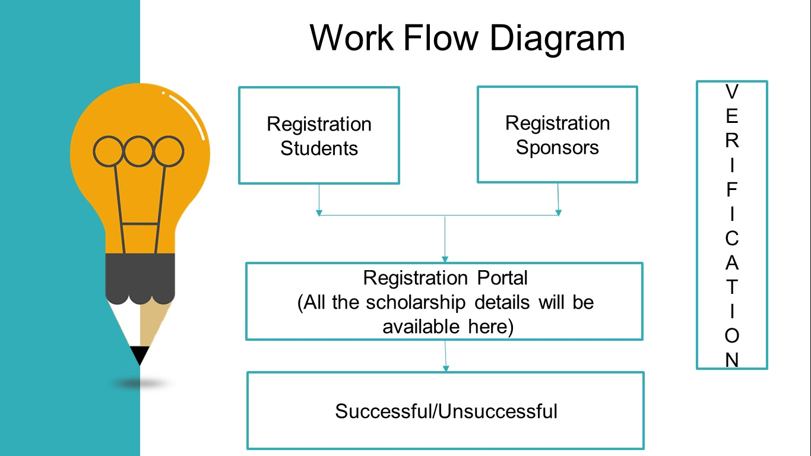

# SCHOLARNET
# An Online Scholarship Management Portal

ScholarNet, a Decentralized application is a common portal created by using BlockChain where the students can apply for the available scholarships and sponsors 
     can provide scholarships.
Verifying the information provided by sponsors and sponsorship seekers by using smart contracts <em>It will be more secure and reliable form of platform 
     where information can be passed at different nodes 
     for fast verification.
  
 It will ease and automate the approval process for students as well as for sponsors and will be available 24/7,thus saving time.
 
 
 
 # Functional Requirements include:
 
Separate registration and login form for Students and Sponsors
Verifying student’s details with the system generated data
Checking the eligibility of student for scholarship
Displaying Scholarship Approval Status   

 
# Development:
 Front end is created using Bootstrap
 Back end is built through php
 
 Database created in phpmyadmin using local xampp server.
 Online solidity IDE used is REMIX IDE, where the contracts are deployed.
 
 Using contract address and ABI this application links to blockchain.
 
 
 
 Minimum Hardware Requirements:
Processor:Intel core i3
RAM:2GB

Software Requirements:
Operating System:Windows 8
Notepad++ v7.5.8
Metamask v4.8.0
Npm package manager v4.0.0
Remix IDE  v0.7.5
Truffle-testrpc v0.0.10

Languages used:
HTML
CSS
PHP
Solidity  v0.4.24 (and above)

 
 

 
 

